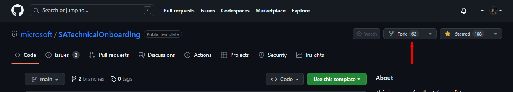

# Welcome to Get Started with Open Source Contribution Repository.
This repository is a collection of resources for beginners who want to contribute in open source projects
and learn how it works, what are the best practices etc..

[](https://github.com/firstcontributions/open-source-badges)


## Contents

[1. Fork a project](#1-fork-a-project)\
[2. Clone the forked project](#2-clone-the-forked-project)\
[3. Create a new branch](#3-create-a-new-branch)\
[4. Make Useful Changes](#4-make-changes)\
[5. Stagging or Adding Chnages](#5-stagingadding-changes)\
[6. Commit Changes](#6-commit-changes)\
[7. Switching branch](#7-switch-branch)\
[8. Merge branch](#8-merge-branch)\
[9. Push code](#9-push-code)\
[10. Submit your changes for review](#10-submit-your-changes-for-review)\
[11. Some useful repos to start with](#🌠some-useful-repos🚀)\
[12. Git Cheat Sheet](https://github.com/UzairHussain193/Get_Start_with_Contributions_Uzair_Hussain/blob/master/git_cheat_sheet.md)


## How can I Contribute?

1. You can contribute in terms of Code
2. You can contribute in terms of improving Documentation

## Basics of Git and GitHub

### Git & GitHub

Before we proceed, it's better to know the difference between Git and Github. Git is a version control system (VCS) that allows us to keep track of the history of our source code , whereas GitHub is a service that hosts Git projects.

We assume you have created an account on Github and installed Git on your System.

Now enter your name and E-mail (used on Github) address in Git, by using following command.

```
$ git config --global user.name "YOUR NAME"
```

``` 
$ git config --global user.email "YOUR EMAIL ADDRESS"
```

If everything went well then now run 
```
git status
```  

This is an important step to mark your commits to your name and email.

---

## 1. Fork a project

You can make a copy of the project to your account. This process is called forking a project to your Github account. On Upper right side of project page on Github, you can see -




Click on fork to create a copy of project to your account. This creates a separate copy for you to work on.

---

## 2. Clone the forked project

You have forked the project you want to contribute to your github account. To get this project on your development machine we use clone command of git.


Now you have the project on your local machine.

---

## 3. Create a New Branch

It is recommended to create a new branch for your contribution. This keeps your changes separate from the main codebase and makes it easier to manage. Use the following command to create a new branch:

```
git checkout -b new-branch-name
```

Replace `"new-branch-name"` with a descriptive name for your branch.

---
## 4. Make Changes

Now you can make the necessary changes to the project code or files. You can use any text editor or integrated development environment (IDE) of your choice.

---
## 5. Staging/Adding Changes

```
$ git add --all
```
or
```
$ git add .
```

These commands adds all the files or you can add specific files by removing -a and adding the file names. 

---
## 6. Commit Changes

After making your changes, it's time to commit them. Committing is the process of saving your changes to Git with a descriptive message. Use the following command:

```
git commit -m "Your commit message"
```

Replace `"Your commit message"` with a brief summary of the changes you made.

---
## 7. Switch Branch

Switching back to the main branch is important to ensure you are up to date with the latest changes in the project. Use the following command to switch back:

```
git checkout main
```
---
## 8. Merge Branch

Before you push your changes, it's recommended to merge the changes from the main branch into your branch. This helps avoid conflicts and keeps your branch up to date. Run the following command to merge the main branch into your branch:

```
git merge new-branch-name
```

Replace `"new-branch-name"` with the name of your branch.

---

## 9. Push code 

You now have a new branch containing the modifications you want in the project you forked. Now, push your new branch to your remote github fork.

```
$ git push origin <feature-branch>
```

---

## 10. Submit your changes for review

If you go to your repository on GitHub, you'll see a `Compare & pull request` button. Click on that button.


Now submit the pull request.


Soon I'll be merging all your changes into the main branch of this project. You will get a notification email once the changes have been merged.


Fantastic! You've already made your first contribution.🥳

---

# 🌠Some Useful Repos.🚀

Here are some useful beginner friendly repositories thorugh which you can start your open source journey.

You can see those by clicking useful repos [Useful Repos](contribution_repos.md)

---

#### BE OPEN!

#### Happy Coding 👩‍💻👩‍💻


<a href="#top"></a>
